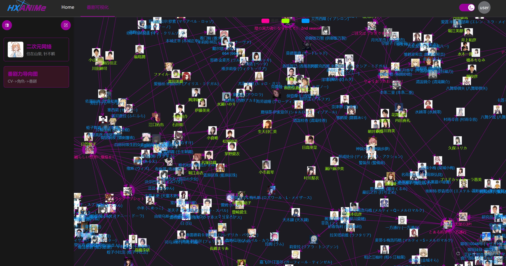
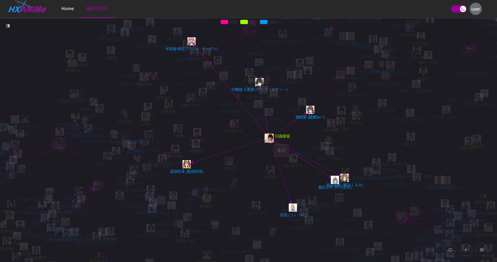
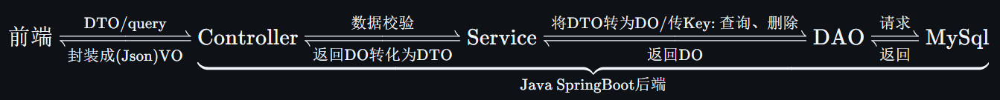

<h1 align="center">HX-ANiMe</h1>  

$HX-ANiMe$ 是一个支持**私有部署**的`力导向图`可视化程序, 您可以将具有 $n$ : $n$ 关系的数据保存到服务器, 并支持您在任意设备之间实时同步。

> [!TIP]
> 以上是番剧信息可视化, 可以把`番剧名称`-`角色`-`声优`以**力导向图**的形式展现出来, 非常的直观!

## 📚 项目简介

**HX-ANiMe** 是一个基于 B/S 架构的开放式数据可视化平台, 旨在通过力导向图直观地展示多对多关系的动态交互。项目的最初目标是构建一个专注于 **番剧-角色-CV** 关联的可视化工具, 但其灵活的设计支持更多复杂的网络结构, 潜在应用场景广阔。

该项目提供了一站式服务, 覆盖前后端完整实现, 包含以下核心技术栈: 
- **前端**: `Vue3` + `ECharts` + `Element-Plus`
- **后端**: `Java` + `Spring Boot`

## 📖 Python API

用户可通过获取的`API Key`自行编写代码, 自动化的完成添加结点、添加边等操作.

为此我们封装了一个[包](./HX-ANiMe-PyApi/HXANiMeApi/), 里面提供了向后端直接通过`API Key`对指向的图的结点、边的增加和查看的Api方法.

文档: [HX-ANiMe-PyApi](./HX-ANiMe-PyApi/README.md)

代码实例:
- [getANiMeCVData.py](./HX-ANiMe-PyApi/getANiMeCVData.py) (爬取番剧信息, 使用`HXPyApi`发送处理后的信息到后端)

## 🛠 项目结构说明
> `HX-ANiMe`  
>
> > `.gitignore` -- 忽略提交配置
> >
> > `README.md` -- 项目自述文件
> >
> > `documents` -- 项目文档资源
> >
> > `HX-ANiMe-Web` -- 前端项目主体
> >
> > `HX-ANiMe-java` -- `Java`项目主体
> >
> > `HX-ANiMe-PyApi` -- `Python`项目主体

## 软件架构
### 总体架构

- POJO 请求链路:

<!-- $$
\text{前端} 
\xrightleftharpoons[\text{封装成(Json)VO}]{\text{DTO/query}} 
\underbrace{
\text{Controller} 
\xrightleftharpoons[\text{返回DO转化为DTO}]{\text{数据校验}}
\text{Service} 
\xrightleftharpoons[\text{返回DO}]{\text{将DTO转为DO/传Key: 查询、删除}} 
\text{DAO} 
\xrightleftharpoons[\text{返回}]{\text{请求}}
\text{MySql}
}_{\text{Java SpringBoot后端}}
$$ -->

- 数据库设计 (ER图):

> [!TIP]
> ApiKey表使用`[用户id, 图表id]`作为联合主键, 然后`api_key`仅为md5值, 并且建立了索引, 以优化查询效率.

### `Java`技术栈

#### 后端核心技术栈

版本匹配参考：

https://github.com/alibaba/spring-cloud-alibaba/wiki/%E7%89%88%E6%9C%AC%E8%AF%B4%E6%98%8E

| 技术                     | 说明                   | 版本          | 备注                                                         |
| ------------------------ | ---------------------- | ------------- | ------------------------------------------------------------ |
| `Lombok`                 | 实体类增加工具         | 1.18.20       | https://github.com/rzwitserloot/lombok                       |
| `Spring Boot`            | Spring快速集成脚手架   | 2.3.12        | https://spring.io/projects/spring-boot                       |

### 前端技术栈

#### 核心技术栈

| 技术           | 说明             | 版本                                                         | 备注                                 |
| -------------- | ---------------- | ------------------------------------------------------------ | ------------------------------------ |
| `Vue`          | 前端框架         | `v3.x`                                                       | https://v3.vuejs.org/                |
| `Vue-Router`   | 路由框架         | `v4.x`                                                       | https://next.router.vuejs.org/       |
| `Pinia`        | 全局状态管理框架 | `v2.x`                                                       | https://pinia.vuejs.org/             |
| `Axios`        | HTTP中间件       | [`v0.27.2`](https://github.com/axios/axios/releases/tag/v0.27.2) | https://github.com/axios/axios       |
| `Element-Plus` | 前端`UI`框架     | `latest`                                                     | https://element-plus.gitee.io/zh-CN/ |
| `Echarts`           | 图一个基于 JavaScript 的开源可视化图表库 | latest   | https://echarts.apache.org/zh/index.html |

#### 测试前端技术栈

| 技术         | 说明       | 版本  | 备注                            |
| ------------ | ---------- | ----- | ------------------------------- |
| `jQuery`     | Ajax框架   | 3.6.0 | https://jquery.com/             |
| `HTML5`      | 文本页面   | 5     | https://www.w3schools.com/html/ |
| `CSS3`       | 页面样式表 | 3     | https://www.w3schools.com/css/  |
| `JavaScript` | 页面小脚本 | `ES6` | https://www.w3schools.com/js/   |

## 环境要求

### 开发工具

| 工具            | 说明                  | 版本      | 备注                                                         |
| --------------- | --------------------- | --------- | ------------------------------------------------------------ |
| `Navicat`       | 数据库连接工具        | latest    | https://www.navicat.com.cn/                                  |
| `PowerDesigner` | 数据库设计工具        | 16.6      | http://powerdesigner.de/                                     |
| `Axure`         | 原型设计工具          | 9         | https://www.axure.com/                                       |
| `MindMaster`    | 思维导图设计工具      | latest    | http://www.edrawsoft.cn/mindmaster                           |
| `Visio`         | 流程图绘制工具        | latest    | https://www.microsoft.com/zh-cn/microsoft-365/visio/flowchart-software |
| `Apipost`       | `API`接口调试工具     | latest    | https://www.apipost.cn/                                      |
| `Git`           | 项目版本管控工具      | latest    | https://git-scm.com/                                         |
| `IDEA`          | `Java`开发`IDE`       | 2022.1.3+ | https://www.jetbrains.com/idea/download                      |
| `Apache Maven`  | Maven 构建工具        | 3.6.3     | https://maven.apache.org/                                    |
| `Docker Maven`  | Maven Docker插件      | 0.40.2    | https://dmp.fabric8.io/ https://github.com/fabric8io/docker-maven-plugin |

### 开发环境

| 依赖环境  | 版本       | 备注                      |
| --------- | ---------- | ------------------------- |
| `Windows` | 10+        | 操作系统                  |
| `JDK`     | 1.8.0_191+ | https://www.injdk.cn/     |
| `NodeJS`  | 16.17.0    | https://nodejs.org/zh-cn/ |
| `NPM`     | 8.19.2     | https://www.npmjs.com/    |

## 特别鸣谢

`HX-ANiMe`的诞生离不开开源软件和社区的支持，感谢以下开源项目及项目维护者：

- `spring`：https://github.com/spring-projects
- `alibaba`：https://github.com/alibaba
- `vue`：https://github.com/vuejs
- `ui`：https://github.com/ElemeFE

同时也感谢其他没有明确写出来的开源组件提供给与维护者。

## 🧐 未来展望

本项目当前仍在开发阶段, 前端只初步完成了`登录/注册`, `力导向图` 界面.

但是仍然还有一些 功能未实现/问题存在:

- 导出为矢量图文件
- 鼠标悬浮增强模式: 会高亮显示这个结点, 以及链路上结点的名称 (可以设置高亮几层邻结点)
- 鼠标悬浮提示增强, 目前悬浮只能看到`id`, 面板还在美化...
- 支持分享(也就是公开)力导向图

(以及更多的其他界面...)

## 💬 联系我们

如果您有任何问题或建议, 欢迎通过 [Issues](https://github.com/HengXin666/HX-ANiMe/issues) 反馈.

## ⭐支持一下

如果觉得框架和项目还不错，点个⭐Star，这将是对**HX-ANiMe**极大的鼓励与支持。